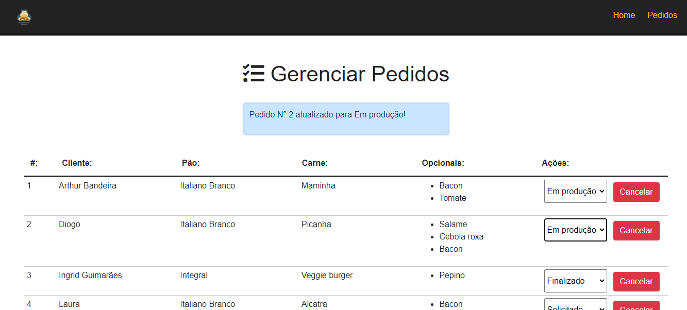
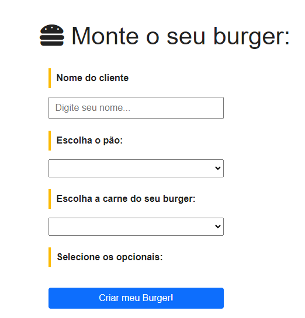

<!-- PROJECT -->
<br />
<p align="center">

  <h2 align="center">Make Your Burger</h2>

  <p align="center">
        Making Burgers...
    <br />
    <a href="https://github.com/ArthurBandeira01/makeburger"><strong>Explore os arquivos »</strong></a>
    <br />
    <br />
    <a href="https://github.com/ArthurBandeira01/makeburger">Ver Demo</a>
    ·
    <a href="https://github.com/ArthurBandeira01/makeburger/issues">Reportar Bug</a>
    ·
    <a href="https://github.com/ArthurBandeira01/makeburger/issues">Implementar Feature</a>
  </p>
</p>


<!-- TABLE OF CONTENTS -->
<details open="open">
  <summary>Lista de conteúdo</summary>
  <ol>
    <li>
      <a href="#Sobre-o-projeto">Sobre o projeto</a>
      <ul>
        <li><a href="#Construido-com">Construido com</a></li>
      </ul>
    </li>
    <li>
      <ul>
        <li><a href="#Instalação">Instalação</a></li>
      </ul>
    </li>
    <li><a href="#Contribuindo">Contribuindo</a></li>
    <li><a href="#Licença">Licença</a></li>
    <li><a href="#Reconhecimentos">Reconhecimentos</a></li>
  </ol>
</details>

<!-- ABOUT THE PROJECT -->
## Sobre o projeto
<p>Mini projeto com finalidade de fazer pedidos de hamburgers e salvar no dashboard da empresa com o status do mesmo, como por exemplo: Solicita, Em Produção ou Finalizado salvando os estudos e exibindo mensagens conforme for alterado ou removido do BD</p>
<hr>

<hr>

<hr>
### Construido com

As tecnologias usadas nesse projeto foram:
* [HTML5](https://developer.mozilla.org/pt-BR/docs/Web/Guide/HTML/HTML5)
* [CSS3](https://developer.mozilla.org/pt-BR/docs/Web/CSS)
* [Javascript](https://developer.mozilla.org/pt-BR/docs/Web/JavaScript/)
* [Vue](https://vuejs.org/)
* [JQuery](https://jquery.com/)
* [SASS](https://sass-lang.com/)

### Pré-requisitos

``` Git, porém não é obrigatório, caso não queira fazer a instação via git, faça o download do repositório ```

### Instalação

```
# Clone este repositório
$ git clone https://github.com/ArthurBandeira01/makeburger.git

```


<!-- CONTRIBUTING -->
## Contribuindo

As contribuições são o que tornam a comunidade de código aberto um lugar incrível para aprender, inspirar e criar. Quaisquer contribuições que você fizer são ** muito apreciadas **.

1. Faça um fork do projeto
2. Crie seu Feature Branch (`git checkout -b feature / AmazingFeature`)
3. Faça commit de suas alterações (`git commit -m 'Add some AmazingFeature'`)
4. Envie para o Branch (`git push origin feature / AmazingFeature`)
5. Abra um pull request


<!-- LICENSE -->
## Licença

Distribuído sob a licença MIT. Veja `LICENSE` para obter mais informações.

# make_your_burger

## Project setup
```
npm install
```

### Compiles and hot-reloads for development
```
npm run serve
```

### Compiles and minifies for production
```
npm run build
```

### Customize configuration
See [Configuration Reference](https://cli.vuejs.org/config/).
